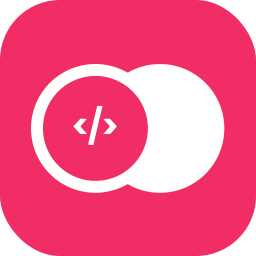
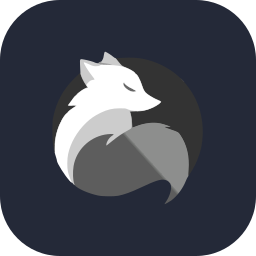
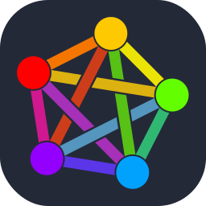
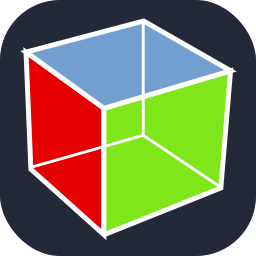
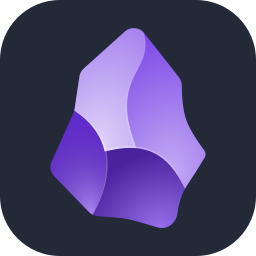
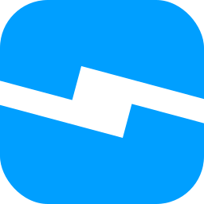
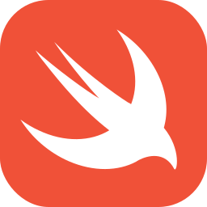

## Hi  👋 My name is Francisco Rodriguez Segura

## Full Stack Developer
- 🖥️ I'm currently learning to program in Python
- 🌍 I live in Trujillo - La Libertad, Peru
- 🖥️ Check --out my portfolio at Francisco R.S
- ✉️ You can contact me at segurafrancis.rod10@gmail.com
- 🧠 I'm learning a new framework

## Skills
 

    

    

  <!--

-->
  <table border="3" align="center">
    <td align="center">
     
    </td>
    <td align="center">
     
    </td>
    <td align="center">
      
    </td>
    <td align="center">
      
    </td>
    <td align="center">
      
    </td>
    <td align="center">
      
    </td>
    <tr>
    <td align="center">
      
    </td>
    <td align="center">
      
    </td>
    <td align="center">
      
    </td>
    <td align="center">
      
    </td>
    <td align="center">
      
    </td>
    <td align="center">
      
    </td>
    <tr>
    <td align="center">
      
    </td>
    <td align="center">
      
    </td>
    <td align="center">
      
    </td>
    <td align="center">
      
    </td>
    <td align="center">
      
  </a>
  </td>
    <td align="center">
      
    </td>
    <tr>
    <td align="center">
      
    </td>
    <td align="center">
      
    </td>
    <td align="center">
      
    </td>
    <td align="center">
      
    </td>
    <td align="center">
      
    </td>
    <td align="center">
      
    </td>
  </table>

## Socials

  

   
   
   
   
   
   
   
  

 

  
  
  
  
  
  
  
 

 

  
  
  
  
  
  
  
 

 

  
  
  
  
  
  
  
 

## Tools for programming
 

<!--

  

-->

Tecnico Profesional en Computacion E Informatica

<!--

<h3 align="center">Tools for programming</h3>

# Icons List

<!--

|      Icon ID       |                         Icon                          |
| :----------------: | :---------------------------------------------------: |
|     `ableton`      |        |
|   `activitypub`    |    |
|      `actix`       |          |
|      `adonis`      |              |
|        `ae`        |        |
|     `aiscript`     |       |
|     `alpinejs`     |       |
|     `anaconda`     |       |
|  `androidstudio`   |  |
|     `angular`      |        |
|     `ansible`      |             |
|      `apollo`      |              |
|      `apple`       |          |
|     `appwrite`     |            |
|       `arch`       |           |
|     `arduino`      |             |
|      `astro`       |               |
|       `atom`       |                |
|        `au`        |            |
|     `autocad`      |        |
|       `aws`        |            |
|       `azul`       |                |
|      `azure`       |          |
|      `babel`       |               |
|       `bash`       |           |
|       `bevy`       |           |
|    `bitbucket`     |      |
|     `blender`      |        |
|    `bootstrap`     |           |
|       `bsd`        |            |
|       `bun`        |            |
|        `c`         |                   |
|        `cs`        |                  |
|       `cpp`        |                 |
|     `crystal`      |        |
|    `cassandra`     |      |
|      `clion`       |          |
|     `clojure`      |        |
|    `cloudflare`    |     |
|      `cmake`       |          |
|     `codepen`      |        |
|   `coffeescript`   |   |
|       `css`        |                 |
|     `cypress`      |        |
|        `d3`        |             |
|       `dart`       |           |
|      `debian`      |         |
|       `deno`       |           |
|      `devto`       |          |
|     `discord`      |             |
|       `bots`       |         |
|    `discordjs`     |      |
|      `django`      |              |
|      `docker`      |              |
|      `dotnet`      |              |
|     `dynamodb`     |       |
|     `eclipse`      |        |
|  `elasticsearch`   |  |
|     `electron`     |            |
|      `elixir`      |         |
|      `elysia`      |         |
|      `emacs`       |               |
|      `ember`       |               |
|     `emotion`      |        |
|     `express`      |      |
|     `fastapi`      |             |
|    `fediverse`     |      |
|      `figma`       |          |
|     `firebase`     |       |
|      `flask`       |          |
|     `flutter`      |        |
|      `forth`       |               |
|     `fortran`      |             |
| `gamemakerstudio`  |     |
|      `gatsby`      |              |
|       `gcp`        |            |
|       `git`        |                 |
|      `github`      |         |
|  `githubactions`   |  |
|      `gitlab`      |         |
|      `gmail`       |          |
|     `gherkin`      |        |
|        `go`        |              |
|      `gradle`      |         |
|      `godot`       |          |
|     `grafana`      |        |
|     `graphql`      |        |
|       `gtk`        |            |
|       `gulp`       |                |
|     `haskell`      |        |
|       `haxe`       |           |
|    `haxeflixel`    |     |
|      `heroku`      |              |
|    `hibernate`     |      |
|       `html`       |                |
|       `htmx`       |           |
|       `idea`       |           |
|        `ai`        |         |
|    `instagram`     |           |
|       `ipfs`       |           |
|       `java`       |           |
|        `js`        |          |
|     `jenkins`      |        |
|       `jest`       |                |
|      `jquery`      |              |
|      `kafka`       |               |
|       `kali`       |           |
|      `kotlin`      |         |
|       `ktor`       |           |
|    `kubernetes`    |          |
|     `laravel`      |        |
|      `latex`       |          |
|       `less`       |           |
|     `linkedin`     |            |
|      `linux`       |          |
|       `lit`        |            |
|       `lua`        |            |
|        `md`        |       |
|     `mastodon`     |       |
|    `materialui`    |     |
|      `matlab`      |         |
|      `maven`       |          |
|       `mint`       |           |
|     `misskey`      |        |
|     `mongodb`      |             |
|      `mysql`       |          |
|      `neovim`      |         |
|      `nestjs`      |         |
|     `netlify`      |        |
|      `nextjs`      |         |
|      `nginx`       |               |
|       `nim`        |            |
|       `nix`        |            |
|      `nodejs`      |         |
|      `notion`      |         |
|       `npm`        |            |
|      `nuxtjs`      |         |
|     `obsidian`     |       |
|      `ocaml`       |               |
|      `octave`      |         |
|      `opencv`      |         |
|    `openshift`     |           |
|    `openstack`     |      |
|       `p5js`       |                |
|       `perl`       |                |
|        `ps`        |           |
|       `php`        |            |
|     `phpstorm`     |       |
|      `pinia`       |          |
|       `pkl`        |            |
|      `plan9`       |          |
|   `planetscale`    |    |
|       `pnpm`       |           |
|     `postgres`     |     |
|     `postman`      |             |
|    `powershell`    |     |
|        `pr`        |            |
|      `prisma`      |              |
|    `processing`    |     |
|    `prometheus`    |          |
|       `pug`        |            |
|     `pycharm`      |        |
|        `py`        |         |
|     `pytorch`      |        |
|        `qt`        |             |
|        `r`         |              |
|     `rabbitmq`     |       |
|      `rails`       |               |
|   `raspberrypi`    |    |
|      `react`       |          |
|    `reactivex`     |      |
|      `redhat`      |         |
|      `redis`       |          |
|      `redux`       |               |
|      `regex`       |          |
|      `remix`       |          |
|      `replit`      |         |
|      `rider`       |          |
|   `robloxstudio`   |        |
|      `rocket`      |              |
|     `rollupjs`     |       |
|       `ros`        |            |
|       `ruby`       |                |
|       `rust`       |                |
|       `sass`       |                |
|      `spring`      |         |
|      `sqlite`      |              |
|  `stackoverflow`   |  |
| `styledcomponents` |    |
|     `sublime`      |        |
|     `supabase`     |       |
|      `scala`       |          |
|     `sklearn`      |    |
|     `selenium`     |            |
|      `sentry`      |              |
|    `sequelize`     |      |
|     `sketchup`     |       |
|     `solidity`     |            |
|     `solidjs`      |        |
|      `svelte`      |              |
|       `svg`        |            |
|      `swift`       |               |
|     `symfony`      |        |
|     `tailwind`     |    |
|      `tauri`       |          |
|    `tensorflow`    |     |
|    `terraform`     |      |
|     `threejs`      |        |
|     `twitter`      |             |
|        `ts`        |          |
|      `ubuntu`      |         |
|      `unity`       |          |
|      `unreal`      |        |
|        `v`         |              |
|       `vala`       |                |
|      `vercel`      |         |
|       `vim`        |            |
|   `visualstudio`   |   |
|       `vite`       |           |
|      `vitest`      |         |
|      `vscode`      |         |
|     `vscodium`     |       |
|       `vue`        |          |
|     `vuetify`      |        |
|       `wasm`       |         |
|     `webflow`      |             |
|     `webpack`      |        |
|     `webstorm`     |       |
|     `windicss`     |       |
|     `windows`      |        |
|    `wordpress`     |           |
|     `workers`      |        |
|        `xd`        |                  |
|       `yarn`       |           |
|       `yew`        |            |
|       `zig`        |            |

-->

## Support Me

